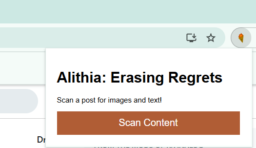
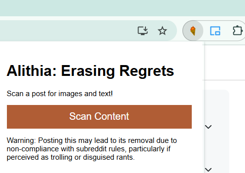

# Alithia: Erasing Regrets (BETA)


## Overview

Alithia is a Chrome extension that helps users avoid potential consequences by scanning content before posting. Using advanced AI analysis, it provides instant warnings about possible outcomes of posting specific content, allowing users to make more informed decisions online.

## Features

- **Content Analysis**: Scans both text and images on the current page
- **Real-time Warnings**: Provides instant feedback about potential consequences
- **User-friendly Interface**: Simple one-click operation
- **Privacy-focused**: All analysis happens via secure API - no data storage

## Gallery

<p align="center">
  
  
</p>

<p align="center"><em>Alithia before and after prediction</em></p>

## Installation

> **BETA NOTICE**: Alithia is currently in beta and requires manual installation and configuration.

### Installation Steps
1. Download or clone this repository
2. **Important**: You need to update the API key in `app/popup.js`:
   - Open `app/popup.js` in a text editor
   - Find the `apiKey` variable (around line 37)
   - Replace it with your own OpenAI API key
3. Open Chrome and navigate to `chrome://extensions/`
4. Enable "Developer mode" in the top-right corner
5. Click "Load unpacked" and select the extension directory
6. The Alithia icon should appear in your browser toolbar

### Getting an API Key
1. Visit [OpenAI's platform](https://platform.openai.com/)
2. Create or log into your account
3. Navigate to the API keys section
4. Generate a new API key
5. Copy and paste this key into the `popup.js` file

## Usage

1. Navigate to any webpage where you're considering posting content
2. Click the Alithia icon in your browser toolbar
3. Click the "Scan Content" button
4. Review the warning about potential consequences
5. Make an informed decision about whether to post

## Technical Details

Alithia works by:
- Extracting text and counting images from the current page
- Sending this information to OpenAI's GPT-4o model
- Processing the AI's analysis to generate a concise warning
- Displaying the result to the user

## Privacy and Security

- Alithia only accesses page content when you explicitly click the scan button
- No data is stored locally or remotely beyond the immediate analysis
- API calls are made securely with proper authentication

## Development

### Prerequisites
- Chrome based browser
- Basic knowledge of JavaScript, HTML, and CSS

### Project Structure
```
├── app/
│   ├── background.js      # Background service worker
│   ├── popup.html         # Extension popup interface
│   ├── popup.js           # Popup functionality
│   ├── styles.css         # Styling for popup.html
│   └── icons/             # Extension icons
├── media/                 # Screenshots and GIFs for README gallery
├── manifest.json          # Extension configuration
├── LICENSE                # MIT License
└── README.md              # This file
```

### Contributing
Contributions are welcome! Please feel free to submit a Pull Request.

1. Fork the repository
2. Create a feature branch (`git checkout -b feature/amazing-feature`)
3. Commit your changes (`git commit -m 'Add some amazing feature'`)
4. Push to the branch (`git push origin feature/amazing-feature`)
5. Open a Pull Request

## Known Issues and Limitations

- **API Key Security**: The current implementation requires storing your API key directly in the code. This is not recommended for production use.
- **API Usage Costs**: Be aware that using the OpenAI API will incur costs based on your usage.
- **Limited Content Detection**: The extension currently only scans visible text and counts images on the page.

## Troubleshooting

- **"Error processing content"**: Verify your API key is correctly entered and has sufficient credits
- **No popup appears**: Make sure the extension is properly installed and has the required permissions
- **Slow response times**: This could be due to API latency or issues with your internet connection

## Future Enhancements

- More secure API key handling
- Firefox port
- Published version on the Chrome & Firefox Web Store

## License

This project is licensed under the MIT License - see the LICENSE file for details.

## Acknowledgments

- Built with OpenAI's GPT-4o API
- Icon created using Krita

---

*Note: Always review and adhere to the terms of service for any platform where you're posting content. Alithia is meant as a helpful tool, not as a guarantee against all possible consequences of online actions.*
